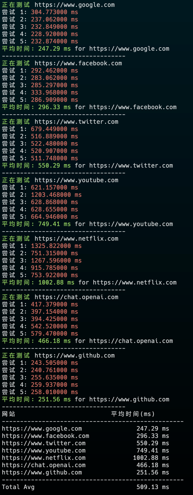

# VPS 常用脚本

## 脚本列表

- **网站响应时间测试**： 测试常用网站的平均响应时间。


### 网站响应时间测试

<div align="center">
    
</div>


国外使用：
```bash
bash <(curl -sL https://raw.githubusercontent.com/mereithhh/vps-scripts/master/test/curl_time.sh) 
```

国内使用：
```bash
bash <(curl -sL https://nodebench.mereith.com/scripts/curltime.sh) 
```