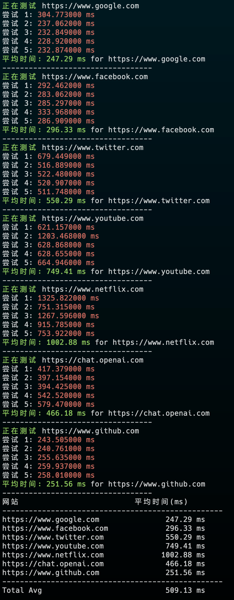

# VPS 常用脚本

## 脚本列表

- **网站响应时间测试**： 测试常用网站的平均响应时间。


### 网站响应时间测试



```bash
curl -sSL https://raw.githubusercontent.com/mereithhh/vps-scripts/main/test/curl_time.sh | bash
```

国内使用：
```bash
bash <(curl -sL https://nodebench.mereith.com/scripts/curltime.sh) 
```